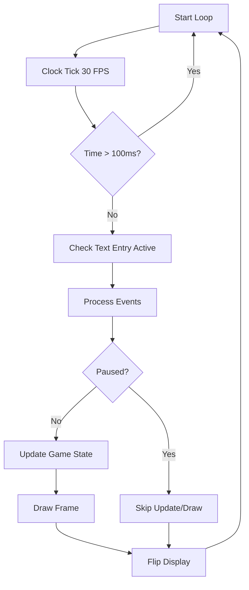

The game loop is the heart of Serenity Valley, handling all game logic, event processing, and rendering in a continuous cycle.

## Main Game Loop

The game loop is implemented in the `run()` method of the `Game` class (game.py:199-254):

```python
def run(self):
    print "Beginning run sequence."
    # The main game loop
    #
    while True:
        # Limit frame speed to 30 FPS
        #
        self.time_passed = self.clock.tick(30)
        
        # If too long has passed between two frames, don't
        # update (the game must have been suspended for some
        # reason, and we don't want it to "jump forward"
        # suddenly)
        #
        if self.time_passed > 100:
            continue
       
        active = False 
        for entry in self.textEntries:
            if entry.clicked:
                active = True
        
        # Event loop
        for event in pygame.event.get():
            if event.type == pygame.QUIT:
                self.quit()
            elif event.type == pygame.KEYDOWN and not active:
                if event.key == pygame.K_SPACE:
                    self.paused = not self.paused
                elif event.key == pygame.K_g:
                    self.options['draw_grid'] = not self.options['draw_grid']
            elif (event.type == pygame.MOUSEBUTTONDOWN and event.button == 1):
                for button in self.buttons:
                    button.mouse_click_event(event.pos)
                for entry in self.textEntries:
                    entry.mouse_click_event(event.pos)
        
        # Update and draw
        if not self.paused:
            msg1 = ''
            msg2 = ''
            self.mboard_text = [msg1, msg2]
            self.draw()
        
        # Flip the display buffer
        pygame.display.flip()
```

## Frame Rate Control

The game uses `pygame.time.Clock` to maintain a consistent frame rate:

```python
self.clock = pygame.time.Clock()
```

The clock limits the game to **30 frames per second (FPS)**:

```python
self.time_passed = self.clock.tick(30)
```

<Note>
The `tick()` method automatically delays the loop to maintain 30 FPS, returning the milliseconds that passed since the last call.
</Note>

### Frame Skip Prevention

If more than 100ms passes between frames (indicating the game was suspended), the frame is skipped to prevent physics "jumping":

```python
if self.time_passed > 100:
    continue
```

## Event Handling

The game processes three main types of events:

### 1. Quit Events

```python
if event.type == pygame.QUIT:
    self.quit()
```

### 2. Keyboard Events

Keyboard events are only processed when text entries are not active:

```python
elif event.type == pygame.KEYDOWN and not active:
    if event.key == pygame.K_SPACE:
        self.paused = not self.paused
    elif event.key == pygame.K_g:
        self.options['draw_grid'] = not self.options['draw_grid']
```

<Tip>
- Press **SPACE** to pause/unpause the game
- Press **G** to toggle the grid overlay
</Tip>

### 3. Mouse Events

Left mouse button clicks are dispatched to interactive widgets:

```python
elif (event.type == pygame.MOUSEBUTTONDOWN and event.button == 1):
    for button in self.buttons:
        button.mouse_click_event(event.pos)
    for entry in self.textEntries:
        entry.mouse_click_event(event.pos)
```

## Update and Draw Cycle

The game only updates and draws when **not paused**:

```python
if not self.paused:
    msg1 = ''
    msg2 = ''
    self.mboard_text = [msg1, msg2]
    self.draw()
```

The `draw()` method (game.py:186-197) handles all rendering:

```python
def draw(self):
    # Draw background image
    self.draw_background()
    
    # Decide if we should draw grid
    if self.options['draw_grid']:
        self.draw_grid()
        
    self.tboard.draw()
    
    for obj in self.world:
        obj.draw()
```

<Note>
All drawing happens to an off-screen buffer. The final `pygame.display.flip()` swaps the buffers to display the rendered frame.
</Note>

## Pause Functionality

The pause system is controlled by a boolean flag:

```python
self.paused = False  # Initialized in __init__ (game.py:122)
```

When paused:
- Events are still processed (allowing unpause)
- Game logic and rendering are skipped
- The display continues to show the last rendered frame

<Tip>
The pause mechanism is simple but effective - it completely halts game updates while keeping the event system responsive.
</Tip>

## Game Loop Flow



The loop continues indefinitely until a QUIT event is received, at which point `sys.exit()` is called.